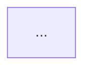

> [!NOTE]
> This document is currently in Korean. The repository owner's translation quota was exceeded.
> To translate it to English, run: `./scripts/sync-i18n.sh`

---
name: design:system-design
description: C4 모델, FMEA, 대략적 규모 산정(QPS)이 포함된 세계 최고 수준의 아키텍처 설계
type: slash-command
category: design
follows-brain:
  - brain/CLAUDE.md
  - brain/engineering/reliability.md
enforcement: required
---

# 🏗️ 월드클래스 시스템 아키텍처 설계 (World-Class System Design)

> ⚠️ **Brain 원칙 준수 필수**
> 이 skill은 아래 문서의 규칙을 반드시 따릅니다. 결과물이 위반되면 즉시 수정하세요.
> - @brain/engineering/reliability.md

단순한 다이어그램 그리기를 넘어, **구글/넷플릭스 수준의 대용량 트래픽 처리(Back-of-the-envelope estimation)**, **장애 모드 영향 분석(FMEA)**, 그리고 **SLI/SLO**를 강제하여 결함 제로에 도전하는 아키텍처 의사결정 기록(ADR)을 생성합니다.

$ARGUMENTS
- `[요구사항 또는 PRD 파일]` — 시스템으로 설계할 대상

## 절차

### 1. 트래픽 및 리소스 규모 산정 (Back-of-the-Envelope Estimation)
- 예상 DAU, QPS(Queries Per Second), 네트워크 대역폭, 스토리지 요구량을 수학적으로 추산합니다.

### 2. 컴포넌트 설계 및 C4 모델 (Mermaid)
- 로드밸런서, 캐시 레이어(Redis/Memcached), 메시지 큐(Kafka/RabbitMQ), 샤딩/레플리케이션이 적용된 DB 아키텍처를 C4 다이어그램으로 도식화합니다.

### 3. FMEA (Failure Mode and Effects Analysis) 및 SLI/SLO
- 각 컴포넌트가 죽었을 때(Network Partition, DB Failover) 시스템이 어떻게 우아하게 저하(Graceful Degradation)되는지 방어책(서킷 브레이커, Retry Backoff)을 명시합니다.

## 출력 형식

반드시 아래의 XML 태그 구조를 준수하여 응답하십시오.

```markdown
<thinking>
이 시스템의 가장 취약한 병목 지점(Bottlenecks)과 엣지 케이스를 찾습니다.
CAP 정리의 트레이드오프와 최종적 일관성(Eventual Consistency)의 한계를 계산합니다.
</thinking>
<plan>
- [ ] 대략적 규모 산정 (QPS, 스토리지)
- [ ] C4 아키텍처 다이어그램 설계
- [ ] FMEA 및 복원력(Resilience) 방어책 수립
- [ ] ADR 렌더링
</plan>
<execution>
### 1. 🧮 대략적 규모 산정 (Estimation)
- **QPS (Read/Write):** 
- **Storage/Bandwidth:** 

### 2. 🗺️ 시스템 아키텍처 (C4 Model)


### 3. 🛡️ 장애 모드 및 영향 분석 (FMEA)
| 컴포넌트 | 실패 시나리오 (Failure Mode) | 비즈니스 임팩트 | 방어 및 복구 전략 (Mitigation) |
| :--- | :--- | :--- | :--- |
| Database | Write Master 다운 | P1 (쓰기 불가) | Read Replica 승격 (자동 Failover), 큐에 Write 임시 버퍼링 |

### 4. 📄 ADR: [아키텍처 결정 사항 요약]
- **Context:** 
- **Decision:** 
- **Alternatives Considered:** 
- **Consequences:** 
</execution>
```
